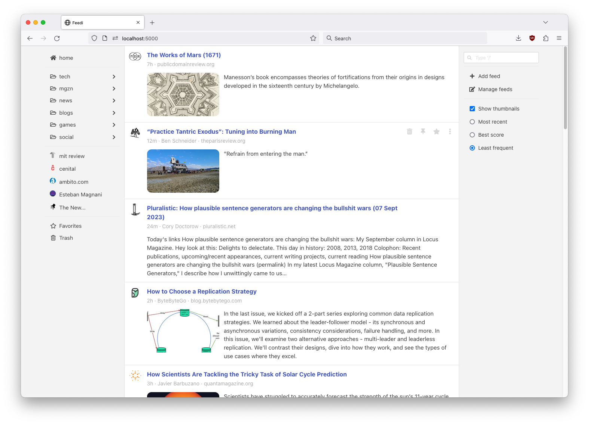

# feedi

feedi is a web feed reader with a minimal interface akin to a Mastodon or Twitter feed.

Features:
- Easy local and self-hosted environment setup.
- Mastodon home and notification streams support.
- Mobile-friendly UI.
- Installable as a Progressive Web App.
- Custom parsers for Reddit, Github and Goodreads.
- Hackable RSS parsers and ad hoc scrapers.
- Smart feed sorting options (highlight infrequent sources, auto mark as read).
- Local article reading and preview using Mozilla's reader mode.
- Send to Kindle device support.




<br/>

For background about the development of this project, see [this blog post](https://olano.dev/2023-12-12-reclaiming-the-web-with-a-personal-reader/).

## Documentation

- [Installation](#installation)
- [Basic usage](#basic-usage)
    - [Adding sources](#adding-sources)
    - [Browsing the feed](#browsing-the-feed)
    - [Reading articles](#reading-articles)
    - [Deleting old articles](#deleting-old-articles)
- [Advanced features](#advanced-features)
    - [Bulk import/export feeds from csv and OPML files](#bulk-importexport-feeds-from-csv-and-opml-files)
    - [Mastodon account setup](#mastodon-account-setup)
    - [Github notification feed](#github-notification-feed)
    - [Goodreads home feed](#goodreads-home-feed)
    - [Reddit feeds](#reddit-feeds)
    - [Kindle device support](#kindle-device-support)
    - [Feed parsing](#feed-parsing)
        - [RSS/Atom feeds](#rssatom-feeds)
        - [Custom feeds](#custom-feeds)
    - [Keyboard shortcuts](#keyboard-shortcuts)
    - [User management](#user-management)
    - [Running with Docker](#running-with-docker)
    - [Non-local setup](#non-local-setup)

## Installation
feedi requires Python >= 3.9. If you don't have it installed already consider using [pyenv](https://github.com/pyenv/pyenv#installation) or [asdf](https://asdf-vm.com/guide/getting-started.html).

To install feedi on a local environment:

    git clone https://github.com/facundoolano/feedi.git
    cd feedi
    make

Then, to run the app:

    make run

The application will be available at `http://localhost:9988/`.

Alternatively, see the instructions for [running with Docker](#running-with-docker) or in a [non-local setup](#non-local-setup).

## Basic usage
### Adding sources
By default, your feed will be empty. You can load content in a number of ways:

* Manually adding a feed by clicking the `+ Add Feed` button or navigating to `/feeds/new`.
* Discovering a website RSS feed by pasting or dragging its url to the search input.
* Loading a set of default websites included in [this repo](feeds.csv) by running: `make feed-load feed-sync`.
* Importing a collection of feeds from an [OPML or CSV file]((#bulk-importexport-feeds-from-csv-and-opml-files)).
* Logging into a [mastodon account](#mastodon-account-setup).

When you first add a feed, the app  will fetch its most recent articles, then it will check periodically for new content (every 30 minutes [by default](https://github.com/facundoolano/feedi/blob/15add28488c5800eef2dbcb43adf1355da9133c3/feedi/config/default.py#L5)).

### Browsing the feed

- Sources can be put into folders, accesible on the left sidebar (desktop) or on the navbar menu (mobile).
- The feed behavior can be tweaked with the controls on the right sidebar (desktop) or on the navbar menu:
- Entries are auto-marked as viewed as the user scrolls down the feed. By default, already seen entries are skipped next time the app is open.
- The default sorting puts least frequent sources at the top. Alternatively, there's are are strict chronological sorting.

### Reading articles
There are different ways to interact with a feed entry:

- If you click on the article title the original website will be open on a new browser tab.
- In some cases, as with link agreggators like reddit, hacker news or lobste.rs, there will be a separate link for the article discussion.
- If you click on the content or press Enter when focusing on the entry, the article content will be fetch and displayed on the local reader. This will be a stripped-down version of the article (removing some site links, ads and paywalls) powered by the [mozilla/readability](https://github.com/mozilla/readability) library. Note that for this to work you need node >= 20 installed when setting up the project.
  -  The reader can also be used to preview arbitrary articles by dragging their url to the searchbox.

### Deleting old articles

Entries get deleted automatically some days after their publication ([defaulting to 7](https://github.com/facundoolano/feedi/blob/f9aaa582d8e690ab8d64baf3286ada8fb64e9f45/feedi/config/default.py#L10)).
Pinned and favorited entries are never deleted. Additionally, a minimum of entries ([defaulting to 5](https://github.com/facundoolano/feedi/blob/f9aaa582d8e690ab8d64baf3286ada8fb64e9f45/feedi/config/default.py#L11)) is kept for all sources, regardless of their publication date.

## Advanced features
### Bulk import/export feeds from csv and OPML files

`make feed-load` will load feeds from a local `feeds.csv` file. A [sample file](https://github.com/facundoolano/feedi/blob/HEAD/feeds.csv) is included in the repo
in case you want to see some content right away.

There's also a `make feed-load-opml` to import a list of RSS feeds from a `feeds.opml` file in the [OPML format](https://en.wikipedia.org/wiki/OPML).

There are analogous `make feed-dump` and `make feed-dump-opml` targets to export feed data from the app.

### Mastodon account setup

The Mastodon integration allows ingesting both the user home feed and the notification inbox as feeds.
feedi first needs to be authorized to access the Mastodon account by navigating to
`Manage feeds > Mastodon login` or to the url `/auth/mastodon`. After filling the instance name
and grating access, feedi will redirect to the add feed form, where either mastodon or mastodon notifications feeds (or both) can be added.

### Github notification feed
You can ingest the notifications from GitHub into feedi. To do so, navigate to your home feed at https://github.com/, open the page HTML source and search for an atom feed link. It should look something like:

``` html
  <link rel="alternate" type="application/atom+xml" title="ATOM" href="/facundoolano.private.atom?token=<TOKEN>" />
```

Copy the href url and use it to add a new RSS feed in feedi.

### Goodreads home feed
You can ingest the notifications from Goodreads.com into feedi. To do so, navigate to your home feed at https://www.goodreads.com/, open the page HTML source and search for an atom feed link. It should look something like:

``` html
<link href='https://www.goodreads.com/home/index_rss/<ID>?key=<KEY>' rel='alternate' title='Goodreads' type='application/atom+xml'>
```

Copy the href url and use it to add a new RSS feed in feedi.

### Reddit feeds

Reddit exposes public pages as RSS feeds by appending `.rss` to the URL, for example `https://www.reddit.com/r/selfhosted.rss` or `www.reddit.com/user/someuser.rss`.

Additionally, authenticated users have access to RSS feeds for private account pages: the front page, saved links, message inbox, etc. Links can be found [here](https://www.reddit.com/prefs/feeds/).
feedi uses special purpose feed parsers both for reddit listing messages and links, and for the user inbox.


### Kindle device support

The app allows to register a kindle email to send the cleaned up article HTML to it, yielding better results
than the default Amazon Send to Kindle Chrome extension. This requires setting up SMTP credentials for sending email.

Steps to make it work with a basic gmail account:
1. Register an google email account.
2. Turn on 2-factor authentication for the account
3. navigate to the [app passwords settings](https://myaccount.google.com/apppasswords) and generate a password for the app (requires 2FA activated to work).
4. Add SMTP settings to the app config:

``` python
FEEDI_EMAIL = "YOUR.EMAIL@gmail.com"
FEEDI_EMAIL_PASSWORD = "GENERATED APP PASSWORD"
FEEDI_EMAIL_SERVER = "smtp.gmail.com"
FEEDI_EMAIL_PORT = 587
```
5. navigate to `/auth/kindle` or type 'kindle' in the searchbox, and enter the @kindle.com email for your device.
6. Go to your [Amazon Personal Document Settings](https://www.amazon.com/mn/dcw/myx.html/ref=kinw_myk_redirect#/home/settings/pdoc) and add your feedi email address to the approved document email list.

After this setup the "Send to Kindle" command will be available when browsing articles.

### Feed parsing

The app works by [periodically](https://github.com/facundoolano/feedi/blob/bf2df4c313e7e719a16d3c2f8216452031a38e58/feedi/config/default.py#L12) fetching
items from different feed sources (RSS/Atom, Mastodon toots and notifications, custom scrapers) and adjusting them to an
[Entry db model](https://github.com/facundoolano/feedi/blob/bf2df4c313e7e719a16d3c2f8216452031a38e58/feedi/models.py#L107) which more or less matches what we expect to display in the front end.

#### RSS/Atom feeds

Most RSS feeds should be processed correctly by the default parser, but sometimes it's desirable to add customizations that cleanup or extend the data for a better look and feel. This can be done by subclassing [feedi.parsers.rss.BaseParser](https://github.com/facundoolano/feedi/blob/4e6b7974b70c70abb4a0f7091adbe344ef0b29a1/feedi/parsers/rss.py#L40). The `is_compatible` static method determines whether a given feed should be parsed with that specific class; the `parse_*` methods overrides the default logic for each field expected in the front end.

As an example, this parser for the lobste.rs link aggregator is adjusted to inline a summary of external link submissions and distinguish between the source article url and the lobste.rs discussion url:

``` python
class LobstersParser(BaseParser):
    def is_compatible(_feed_url, feed_data):
        return 'lobste.rs' in feed_data['feed'].get('link', '')

    def parse_content_short(self, entry):
        # A 'Comments' link is only present on external link submissions
        if 'Comments' in entry['summary']:
            url = self.parse_content_url(entry)
            return (self.fetch_meta(url, 'og:description') or
                    self.fetch_meta(url, 'description'))
        return entry['summary']

    def parse_entry_url(self, entry):
        # return the discussion url, which is different from entry['link']
        # for external links
        if 'Comments' in entry['summary']:
            soup = BeautifulSoup(entry['summary'], 'lxml')
            return soup.find("a", string="Comments")['href']
        return entry['link']
```

You can see several custom RSS parsers in [this module](https://github.com/facundoolano/feedi/blob/main/feedi/parsers/rss.py).

#### Custom feeds

Other than RSS and Mastodon feeds, the app can ingest arbitrary sources with custom parsers. This is useful for scraping websites that don't provide feeds or consuming JSON APIs directly.

To add a custom parser, subclass [feedi.parsers.custom.CustomParser](https://github.com/facundoolano/feedi/blob/4e6b7974b70c70abb4a0f7091adbe344ef0b29a1/feedi/parsers/custom.py#L20). The `is_compatible` method determines wheter a given url should be parsed with that parser. The `fetch` method does the actual fetching and parsing of entries. See the [feedi.parsers.custom](https://github.com/facundoolano/feedi/blob/HEAD/feedi/parsers/custom.py) module for some examples.

Once the parser is implemented, it will be used when a new feed of type "Custom" is added in the webapp with the expected url.


### Keyboard shortcuts

| shortcut                              | when                         | action                              |
| -----------                           | -----------                  | ---------                           |
| Cmd+k                                 |                              | focus search input                  |
| Enter                                 | search focused               | submit first suggestion             |
| Escape                                | search or suggestion focused | hide suggestions                    |
| Down Arrow, Ctrl+n                    | search or suggestion focused | next suggestion                     |
| Up Arrow, Ctrl+n                      | suggestion focused           | previous suggestion                 |
| Enter                                 | entry focused                | open entry content                  |
| Cmd+Enter, Cmd+Left Click             | entry focused                | open entry content on new tab       |
| Cmd+Shift+Enter, Cmd+Shift+Left Click | entry focused                | open entry discussion on new window |
| Down Arrow, Tab                       | entry focused                | focus next entry                    |
| Up Arrow, Shift+Tab                   | entry focused                | focus previous entry                |
| p                                     | entry focused                | pin entry                           |
| f                                     | entry focused                | favorite entry                      |
| Escape                                | viewing entry content        | go back                             |

### User management

The default app configuration assumes a single-user unauthenticated setup, but authentication can be enabled in case security is necessary,
for example to deploy the app on the internet or to support multiple accounts.

To enable user authentication:

1. Remove the `DEFAULT_AUTH_USER` setting from the [configuration](https://github.com/facundoolano/feedi/blob/HEAD/feedi/config/default.py).
2. If you already have a DB created, reset it with `make db-reset`. Or, alternatively, remove the default user
with `make user-del EMAIL=admin@admin.com`. Note that this will also remove feeds and entries associated to it in the DB.
3. You can create new users by running `make user-add EMAIL=some@email.address`. The command will prompt for a password.

Note that there's no open user registration functionality exposed to the front end, but it should be straightforward to add it if you need it. Check the [auth module](https://github.com/facundoolano/feedi/blob/HEAD/feedi/auth.py) and the [flask-login documentation](https://flask-login.readthedocs.io/en/latest/) for details.

### Running with Docker

Get the image from github packages:

    docker pull ghcr.io/facundoolano/feedi:latest

Create a volume for persisting the db data:

    docker volume create feedidb

Load the default feeds into the default admin user:

    docker run -v feedidb:/app/instance ghcr.io/facundoolano/feedi flask --app feedi/app.py feed load feeds.csv admin@admin.com
	docker run -v feedidb:/app/instance ghcr.io/facundoolano/feedi flask --app feedi/app.py feed sync

Run in development mode:

    docker run -p 9988:9988 -v feedidb:/app/instance ghcr.io/facundoolano/feedi

To run in production mode, a config file with at least a secret key is expected:

    echo "SECRET_KEY = '$(python -c 'import secrets; print(secrets.token_hex())')'" >> production.py
    docker run -p 9988:9988 -e FLASK_ENV=production -v feedidb:/app/instance -v $(pwd)/production.py:/app/feedi/config/production.py ghcr.io/facundoolano/feedi

To enable authentication, add `DEFAULT_AUTH_USER=None` to that production config file.

### Non-local setup
You can refer to the [Flask documentation](https://flask.palletsprojects.com/en/2.1.x/deploying/) for a instructions on how to deploy feedi to a non-local environment. The [setup script](./setup_server.sh) included in the repository shows an example setup for a Debian server. You can run it remotely with ssh like `make prod-install SSH=user@server`.
